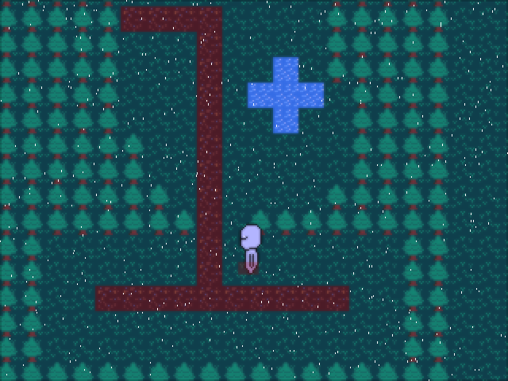

# Legends-JRPG
Tactics JRPG in the late SNES style, "Nothing but my blade and shame."

This game is made in C99 sort of on and off, and as of now it's not complete, and is in active development.

It's a software rendered engine working within a mainly fixed memory footprint and has
a custom lisp based scripting language. The engine is mostly independent and uses
a few libraries (SDL, stb are the only notable dependencies), with the vast majority
of the codebase being independent from any platform.

As it's a software renderer with postprocessing it's kind of slow without multithreading
and so this engine is best run with a multi-core processor for playable performance at
higher resolutions (or even the base resolution.)

It's heavily inspired by games of the late SNES era, and some tactics RPGs. It aims to
be essentially inspired by a game of the era, but is distinctly not of the era.

As I'm a college student and a solo developer it will presumably take a long time before any game comes out,
and most definitely might suffer lots of cutting room floor due to time constraints (of not wanting to work on one project
forever.)

(NOTE: there will probably not be a full hardware accelerated option. It's not impossible, but it's a bit annoying
for me to do right now. I might go back and do this at some point but there's little point in doing so since it doesn't really
make the game look better, and since the software renderer works at a very low base resolution it won't improve performance by much...

It might fix the battery life issue though.)

## Latest Screenshot

